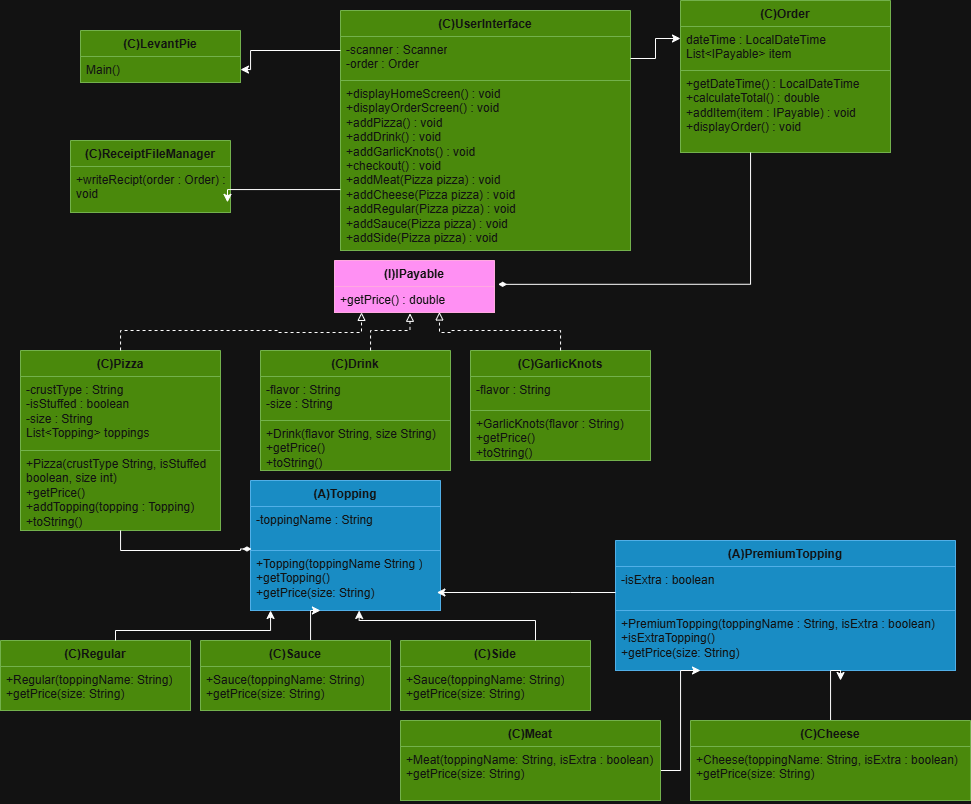
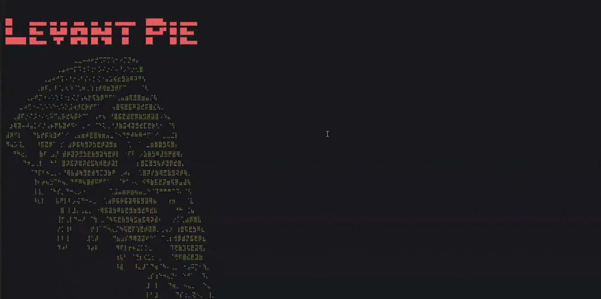

# Levant Pie🍕

## Description of the Project

I built this application to help a local pizza shop called Levant Pie move their business from paper orders to an online digital system.
The program walks a customer through a full menu where they can build a pizza by choosing the crust, size, stuffed crust or not, meat topping, 
cheese topping, regulate topping, sauce, and sides they want. I made is so you can add as many toppings as you like, and the app handles 
all the math for the different prices. You can also add Drinks and Garlic knots to the order. At the end the program shows a summary 
of everything the customer bought and saves the receipt in a folder named with date and time so the shop has a record of the sale.

## UML Diagram

## User Stories📖
- As a developer, I want a price standard so every item in the shop follows the same rule.
- As a user, I want to pick my own toppings so I can build my own pizza.
- As a user, I want to add free toppings so I can flavor my pizza.
- As a developer, I want to handle extra portions separately so I can charge more for them.
- As a user, I want to add meats and cheeses so I can customize my pizza.
- As a user, I want garlic knots as a side.
- As a user, I want to pick a soda, so I don't get thirsty.
- As a user, I want to build a pizza with a specific crust and size so it's exactly what I want.
- As a user, I want the order to record the date and time and show me the total price of my order.
- As a user, I want a receipt so I can have a record of what I bought.
- As a developer, I want a Main so I can start up the program on.
- As a user, I want a menu so I can interact with the shop.

## Setup

1. Open IntelliJ IDEA.
2. Open the Levant Pie project
3. Locate the LevantPie.java file
4. Right-click the file and select "Run 'LevantPie.main()'"

### Prerequisites

- IntelliJ IDEA: Ensure you have IntelliJ IDEA installed, which you can download from [here](https://www.jetbrains.com/idea/download/).
- Java SDK: Make sure Java SDK is installed and configured in IntelliJ.

### Running the Application in IntelliJ

Follow these steps to get your application running within IntelliJ IDEA:

1. Open IntelliJ IDEA.
2. Select "Open" and navigate to the directory where you cloned or downloaded the project.
3. After the project opens, wait for IntelliJ to index the files and set up the project.
4. Find the main class with the `public static void main(String[] args)` method.
5. Right-click on the file and select 'Run 'YourMainClassName.main()'' to start the application.

## Technologies Used

- Java 17
- Git/GitHub

## Demo

## Resources

- [Java Visual Learning Hub](https://raymaroun.github.io/yearup-java-visuals/)
- [My Past Projects/Exersices](https://github.com/CraftedByAdam?tab=repositories)
- [Raymond's Uploaded Projects/Exersices solutions](https://github.com/RayMaroun/yearup-spring-section-8-2026/tree/main/pluralsight/java-development)
- [StringBuilder Class in Java](https://www.geeksforgeeks.org/java/stringbuilder-class-in-java-with-examples/)
- [draw.io UML Builder](https://app.diagrams.net/)
- [Text to ASCII Art Generator](https://patorjk.com/software/taag/#p=display&f=Graffiti&t=Type+Something+&x=none&v=4&h=4&w=80&we=false)
- [ASCII Logo/image](https://emojicombos.com/combination)

## Thanks

- Thank you to Raymond Maroun for continuous support and guidance.